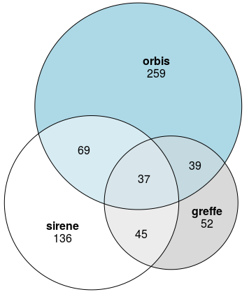

layout: true
  

`r paste0("
", params$event, " 

")` 

---

class: center, middle

Ces slides en ligne : `r paste0("http://datactivist.coop/", params$slug)`

Sources : `r paste0("https://github.com/datactivist/", params$slug)`

Les productions de Datactivist sont librement réutilisables selon les termes de la licence [Creative Commons 4.0 BY-SA](https://creativecommons.org/licenses/by-sa/4.0/legalcode.fr).

 
 

---

class: inverse, left, middle

## Contexte

La [loi 2017-399 du 27 mars 2017](https://www.legifrance.gouv.fr/eli/loi/2017/3/27/2017-399/jo/texte) relative au devoir de vigilance des sociétés mères et des entreprises donneuses d'ordre (dite **"*loi devoir de vigilance*"**) instaure l'obligation de l'établissement et de la mise en oeuvre d'un plan de vigilance relatif à l'activité de la société et de l'ensemble des filiales ou sociétés qu'elle contrôle portant sur les risques et la prévention des atteintes graves envers les droits humains et fondamentaux, la santé et la sécurité des personnes et de l'environnement résultant de ses activités.

Les entreprises devant mettre en oeuvre un tel plan sont ainsi définies comme :
* employant **au moins 5000 salariés en France** dans leur sein et leurs filiales **à la clôture de deux exercices consécutifs** ;
* employant **au moins 10000 salariés en France ou à l'étranger** dans leur sein et leurs filiales **à la clôture de deux exercices consécuritfs**.

---

class: inverse, left, middle

## Démarche

**Aucune liste des entreprises concernées n'étant fournies par le législateur**, nos organisations ignorent le champs d'application de cette loi.

Afin d'évaluer ce périmètre, nous avons procédé à une analyse des données disponibles en open data offrant des effectifs pour les entrepriss françaises. Nous avons croisé les listes ainsi obtenus pour évaluer la cohérence des données publiques. Nous avons enfin confronté ces listes "ouvertes" à des listes payantes mises à disposition par des plateformes privées d'intelligence économique ainsi qu'à la liste des entreprises s'étant déclarées éligibles et aux effectifs publiés par ailleurs.

Notre démarche poursuit ainsi trois objectifs :
1. proposer **une liste "a minima"** d'entreprises concernées par la loi ;
2. évaluer **l'utilité des données ouvertes** pour cet usage ;
3. questionner **la pertinence du cadre légal** pour remplir les objectifs que se fixe la loi.

---
## Méthodologie

### Analyse de données
En s'appuyant sur les bases de données Sirene et Infogreffe, nous avons établi des listes suivant les critères énoncés par la loi. Puis, nous les avons confrontés à deux sources non officielles : la base Orbis, commercialisée par Bureau van Dijk, et la liste établie par CCFD et Sherpa à partir de sources ouvertes. Les taux de recoupement apparaissent comme un indicateur pertinent de la validité des données mises à disposition par les administrations françaises.

### Requêtes CADA
En vertu de la loi relative à l'accès aux documents administratifs de 1978, nous avons sollicité les deux organismes producteurs de la base de liaison financières Lifi, l'Insee et le ministère des Finances. Le déroulement de ces démarches nous renseignent sur la disponibilité des données nécessaires pour mettre la loi en application.

---

class: inverse, center, middle

# Analyse de données

---

## Base Infogreffe

La base Infogreffe met à disposition en open data les données du registre du tribunal de Commerce. Elle recense les entreprises déclarées à travers la France ainsi que des données micro-économiques sur un principe déclaratif.

Les données sont disponibles sur le site d'Infogreffe soit sous forme de tableau interactif, soit sous forme de "chiffres clefs" par année avec trois années de profondeur temporelle sur les effectifs et le chiffre d'affaires. La base stipule également la forme juridique des entreprises.

Infogreffe offre donc les informations minimales requises pour établir une première liste d'entreprises concernées par la loi Devoir de vigilance.

---

### Première liste 

#### Millésime 2018
La dernière édition des "chiffres clefs" porte le millésime 2018, entendu comme "situation déclarée au 31/12/2018". A la date de consultation (25/04/2019), le fichier proposé au téléchargement ne proposait que 262760 entreprises.

L'application des critères de la loi nous amène à une liste de 5 entreprises cumulant des effectifs supérieurs à 5000 salariés en France deux années successives. Ce résultat s'explique, comme supposé plus haut, par le fait que la plupart des entreprises n'ont pas déclaré leur situation  (le jour même du téléchargement, elles étaient encore 5081 à avoir été enregistrées).

#### Millésime 2017

Le millésime 2017 présente un stock de 1103530 entreprises déclarées. **L'application des critères de la loi Devoir de vigilance amène à l'identification de 52 entreprises déclarant plus de 5000 salariés deux années consécutives (exercice 2016 et 2017 révolus)**.

---

### Formes juridiques

L'analyse des formes juridiques fait apparaître une certaine homogénéité : **la majorité des entreprises répondant aux critères de la loi sont des SAS (23), des SAI (11) et des SASU (8)**. L'intégralité des entreprises relèvent du droit commercial.

---

## Sirene

La base Sirene est le service de référence pour l'identité des entreprises installées en France. Elle propose des stocks par unités légales et par établissements, proposant pour les premières des effectifs par tranche ou à 100 salariés près (suivant les anciens dessins L2 remplacés par de nouveaux standards au 01/05/2019).

En nous saisissant des stocks aux mêmes dates de référence que les fichiers greffe (stock décembre 2016 assimilé janvier 2017 et décembre 2017 assimilé janvier 2018), nous disposons des effectifs approximés à 100 salariés et des formes juridiques nous permettant de tester les critères de la loi Devoir de vigilance pour établir une liste.

---

### Première liste

**Un premier tri pour les années 2017 et 2018 nous amène à un total de 230 entreprises remplissant les critères de la loi Devoir de vigilance.**

---

### Formes juridiques

L'analyse des formes juridiques des entreprises indique cependant que toutes ces sociétés ne relèvent pas du même régime :
* 79 entreprises relèvent du droit administratif (collectivités territoriales, hôpitaux, université, etc.) ;
* 5 tombant sous la catégorie "groupement de droit privé", sont des organismes caricatifs (Croix Rouge, Association des paralysés de France, Fondation d'Auteuil...).

Une fois écartées ces deux catégories, **nous obtenons une liste de 136 entreprises soumises au droit commercial ayant employé plus de 5000 salariés deux années de suite en France**.

---

### Intersection

En croisant les identifiants uniques Siren des entreprises répondant aux critères de la loi Devoir de vigilance, il apparaît que **l'intersection des deux listes se limite à 45 unités légales**. Aucune des bases ne peut donc être considérée comme suffisante à établir une liste complète.

---

## Base Orbis

[La base de données Orbis](https://www.bvdinfo.com/fr-fr/our-products/company-information/international-products/orbis) est un service fourni par la société Bureau van Dijk (filiale du groupe d'analyse financière Moody's).

Elle propose aux acteurs privés et publics des données micro-économiques sur 300 millions d'entreprises dans le monde, notamment leurs effectifs. Parmi les critères de recherche, elle offre la possibilité de retracer les liens de propriété financière entre les établissements d'une même entreprise à l'internationale, offrant ainsi une estimation du périmètre réel de ces sociétés.

Cette base étant d'accès limité et payant, nous la considérons comme **un étalon de l'exhaustivité des données disponibles en open data**. Nous ne disposons par ailleurs par de la profondeur historique de deux années requises par la loi. Nous l'utiliserons ainsi uniquement comme outil de comparaison.

---

### Premières listes

La liste Orbis permettant un filtre par effectif à l'échelle de la France et à l'échelle mondiale, nous pouvons tester les critères nationaux et internationaux de la loi.

#### Plus de 5000 salariés France

Au critère de "plus de 5000 salariés en France", **la base Orbis renvoie une liste de 259 entreprises, soit près du double de Sirene** (la plus importante établie en open data).

#### Plus de 10000 salariés mondialement

**La base Orbis renvoie 147 entreprises cumulant plus de 10000 salariés au niveau mondial dans leurs filiales détenues directement ou indirectement**, soit plus que le nombre total d'entreprises enregistrées pour Sirene.

L'intersection des deux listes par nom renvoie 145 établissements, indiquant que la quasi totalité des entreprises dépassant le seuil d'emploi à l'international (147) le dépassent déjà en France..

---

### Croisement des listes par nom

.pull-left[Nous établissons un croisement par nom entre la base Orbis pour le critère français et les deux autres bases. **Seules 37 noms d'entreprises** se retrouvent dans les trois bases.

** Rappel méthodologique** :
*les recoupements sont réalisés sur les noms et non sur les identifiants uniques siren (non disponibles sur Orbis) et sont donc moins précis. Ces comparaisons sont à utiliser avec réserve comme des calculs a minima.*]

.pull-right[

]

---

## Liste établie par CCFD et Sherpa

Sur la base de données ouvertes, les associations CCFD Terres solidaires et Sherpa ont établi une liste des entreprises ayant déclarées être soumises à la loi Devoir de vigilance ou ayant déjà publié un plan en 2017 et en 2018.

# WIP
1. normaliser la base ;
2. traiter les cas particuliers ;
3. opérer les comparaisons.

---

### Comparaisons avec les listes ouvertes

# WIP

---

class: inverse, center, middle

# Requêtes CADA

---

## Base Lifi

La base de données Liaisons financières ([Lifi](https://www.insee.fr/fr/metadonnees/source/serie/s1038)) est un système d'information décrivant les liens capitalistiques entre les entreprises à l'échelle internationale.

Elle est alimentée par de nombreuses sources : Banque de France, direction des Finances publiques, Insee, Orbis et rapports d'activités.

D'après les informations disponibles en ligne et des avis de spécialistes que nous avons consulté, cette base pourrait combler de nombreuses lacunes des données disponibles, notamment sur le plan des effectifs internationaux.

Ces données n'étant pas disponible en open data mais présentant un intérêt pour l'intérêt général, nous avons initié une démarche de demande officielle auprès des organismes producteurs pour obtenir communication d'un extrait correspondant aux critères de la loi.

---

### Requêtes aux producteurs - 1

Pour obtenir communications, nous nous sommes tournés vers les deux organismes désignés comme producteurs :
* la Direction générale des finances publiques (Dgfip) du ministère de l'Economie ;
* l'Insee.

Nous nous appuyons dans cette démarche sur la loi n° 78-575 du 17 juillet 1978 relative à l'accès aux documents administratifs (dite, "loi Cada"). La loi stipule un délai légal de réponse d'un mois pour toute demande. Les envois ont été réalisé entre fin février et début mars 2019.

#### Réponse Dgfip
Le pôle données de la Dgfip a répondu à notre requête par un refus. Elle nous a renvoyé à la Direction des Statistiques des entreprises de l'Insee, gestionnaire de la base (que nous avions contacté parallèlement).

---

### Requête aux producteurs - 2

#### Réponse Insee
L'Insee a également décliné notre demande, motivant ainsi son refus :
> La source LIFI, constituée notamment de renseignements individuels collectés auprès d’entreprises par voie d’enquêtes de statistique publique, est pour cette raison couverte par le secret statistique.

L'article 6 de la loi 51-711 du 7 juin 1951 sur le secret statistique ouvre le droit de formuler une demande auprès du Comité du secret statistique pour consulter la base.

# WIP

---

## Requête Cada

# WIP

---

class: inverse, center, middle

# Conclusions

---

## Listes

#### Liste commune
Nous proposons une première liste établie par croisement des bases de données Sirene et greffe sur deux années successives (exercices 2017 et 2018) de 45 enreprises correspondant aux critères de la loi Devoir de vigilance :

# WIP
1. mise en forme de la liste

---

#### Liste Sirene

Nous proposons une première liste établie par croisement des bases de données Sirene et greffe sur deux années successives (exercices 2017 et 2018) de 45 enreprises correspondant aux critères de la loi Devoir de vigilance :

# WIP
1. mise en forme de la liste

---

### Cas particuliers

#### Les sociétés en commandite (catégorie 53)
Les listes que nous avons établi totalisent 3 sociétés en commandite (EURO DISNEY ASSOCIES SCA, VEOLIA EAU - COMPAGNIE GENERALE DES EAUX et MANUFACTURE FRANCAISE DES PNEUMATIQUES MICHELIN), exclue en droit de l'application. Néanmoins, ces entreprises sont déclarées sous la forme de "Société en commandite par actions", lesquelles ne bénéficient pas de cette exemption.

#### Les sociétés à responsabilité limitée, SARL (catégorie 54)
Trois entreprises de la liste issue de la base Insee rentrent dans la catégorie SARL, exclue du champs d'application : SECURITAS FRANCE SARL (SARL unipersonnelle) et ZARA FRANCE et H&M HENNES & MAURITZ (SARL sans autre indication).

**Trois entreprises répondant aux critères d'effectifs de la loi Devoir de vigilance doivent donc être écartées du fait de leur forme sociale : H&M, Securitas et Zara.**

---

## Cas

---

## Utilité des données ouvertes

# WIP
1. les bases de données ne s'avèrent pas cohérentes les unes par rapport aux autres, notamment du fait des modalités d'enregistrement ;
2. parler des nouveaux formats Insee ?
3. les données pertinentes s'avèrent payantes
4. Recommandation 1 : renforcer les obligations de déclaration ?
5. Recommandation 2 : modifier les formats de publication pour faciliter l'identification des critères (normaliser les rapports annuels, par exemple ?)

---

## Pertinence du cadre légal

# WIP
1. ?
2. le statut juridique des entreprises 

---

class: inverse, center, middle

# Merci !
